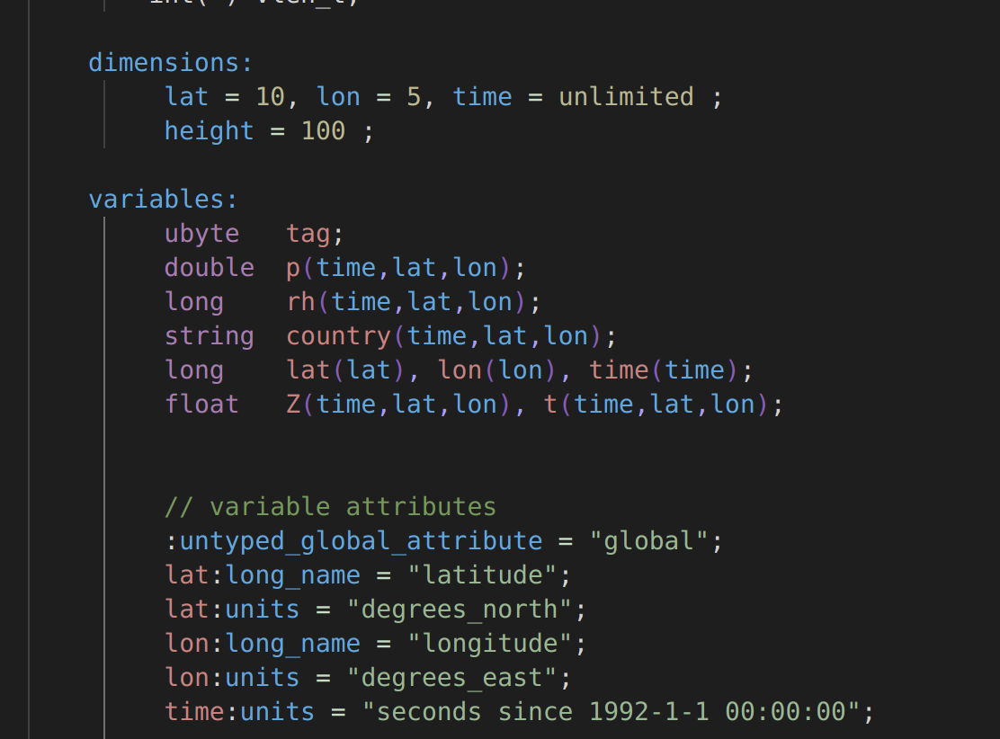

# netcdf-cdl

NetCDF is a structured cross-platform data storage format, [Github](https://github.com/Unidata/netcdf-c).

This package provides syntax highlighting for the NetCDF cdl language. The grammar of the language can be found in the most concise form in [Ubuntu man pages](https://manpages.ubuntu.com/manpages/bionic/man1/ncgen.1.html)

Currently supported CDL grammar components

- [x] groups
- [x] sections
- [x] dimension declaration
- [x] variable declaration
- [x] global attribute declaration
- [ ] typed attribute declaration
- [ ] user defined types
- [ ] data section

An example highligting



Can be achieved with the following user defined types in VSCode `settings.json`

```json
"editor.tokenColorCustomizations": {
        "textMateRules": [
            {
                "scope": "entity.dimension.cdl",
                "settings": {
                    "foreground": "#42aae2"
                }
            },
            {
                "scope": "storage.type.numeric.cdl",
                "settings": {
                    "foreground": "#b27bb3"
                }
            },
            {
                "scope": "variable.other.cdl",
                "settings": {
                    "foreground": "#d77f7f"
                }
            },
            {
                "scope": "support.attribute.global.cdl",
                "settings": {
                    "foreground": "#42aae2"
                }
            },
            {
                "scope": "keyword.language.section.cdl",
                "settings": {
                    "foreground": "#42aae2"
                }
            },
            {
                "scope": "constant.language.cdl",
                "settings": {
                    "foreground": "#42aae2"
                }
            },
            {
                "scope": "constant.numeric.cdl",
                "settings": {
                    "foreground": "#b8b990"
                }
            },
            {
                "scope": "string.quoted.double.cdl",
                "settings": {
                    "foreground": "#90b991"
                }
            },
            {
                "scope": "punctuation.bracket.cdl",
                "settings": {
                    "foreground": "#8e5abc"
                }
            },
            {
                "scope": "punctuation.comma.cdl",
                "settings": {
                    "foreground": "#aba0fa"
                }
            },
            {
                "scope": "punctuation.semicolon.cdl",
                "settings": {
                    "foreground": "#e9d5fb"
                }
            },
            {
                "scope": "punctuation.equals.cdl",
                "settings": {
                    "foreground": "#c1dec5"
                }
            },
            {
                "scope": "comment.line",
                "settings": {
                    "foreground": "#90B991"
                }
            }
        ]
    }
```


## Release Notes

### 0.1.0

Initial release of netcdf-cdl
